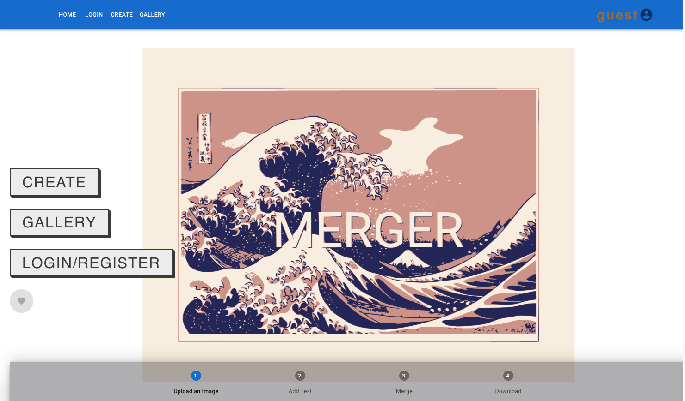
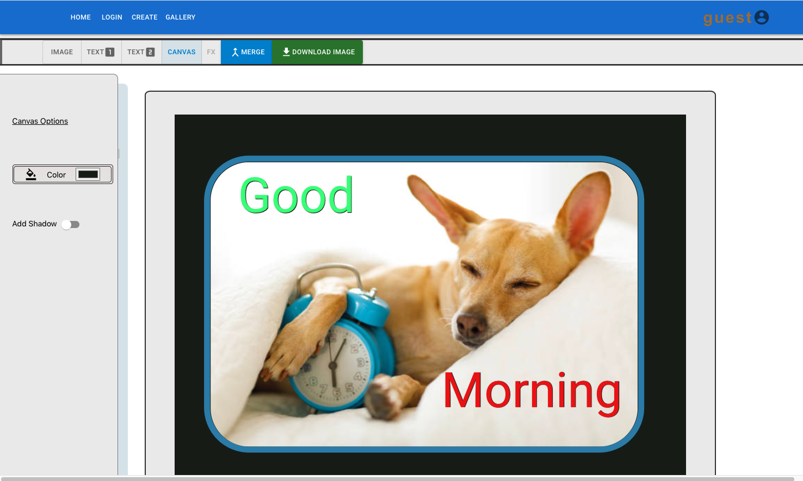
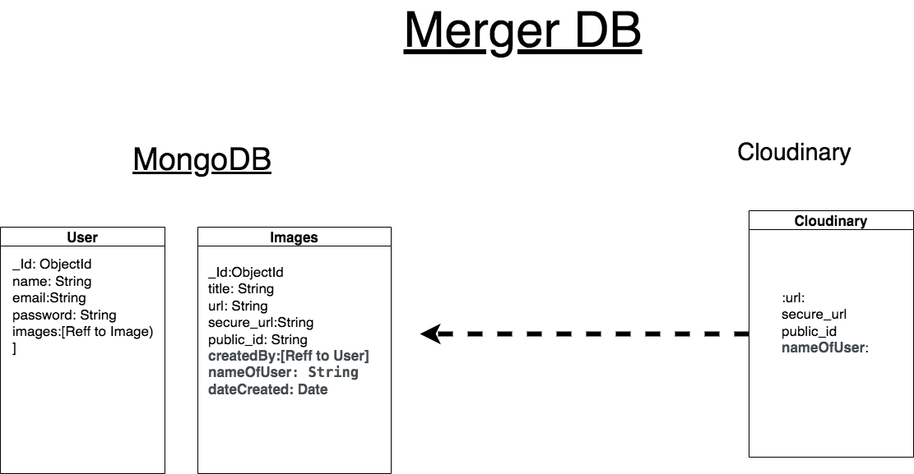
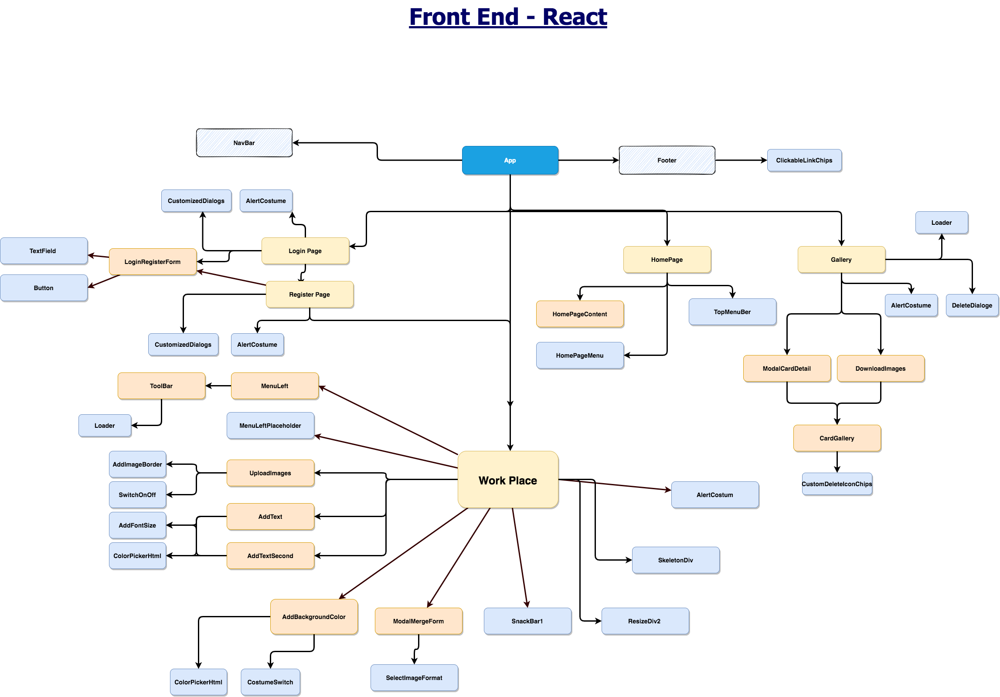
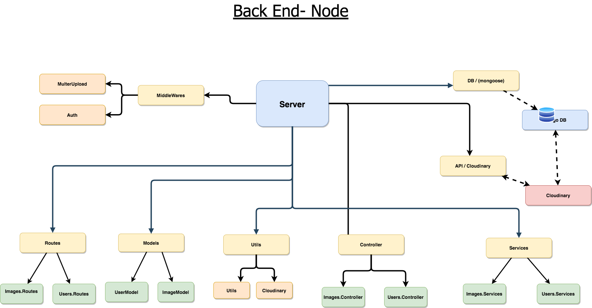
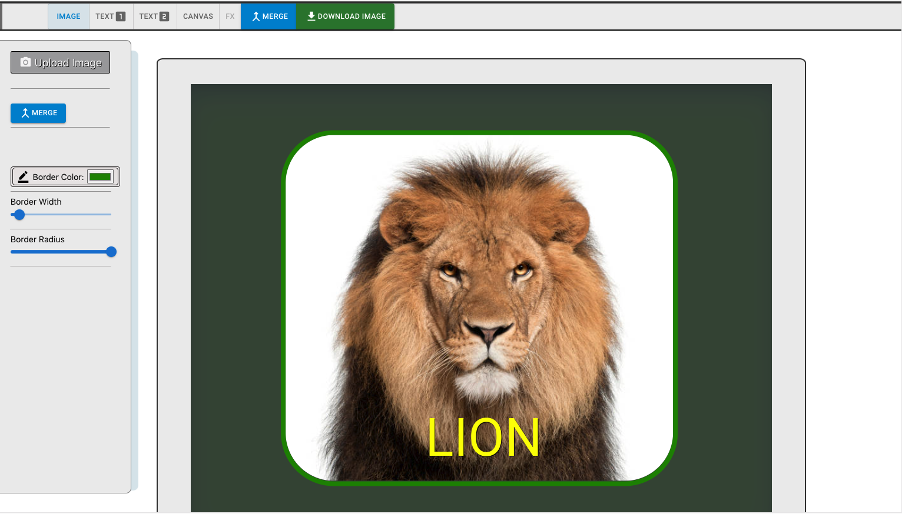
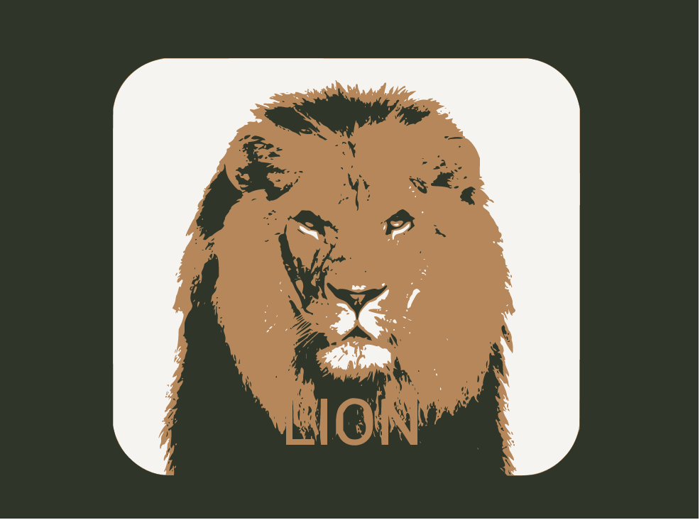
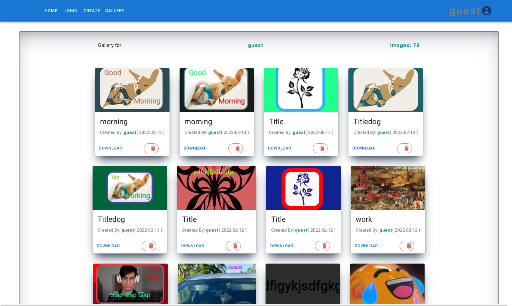
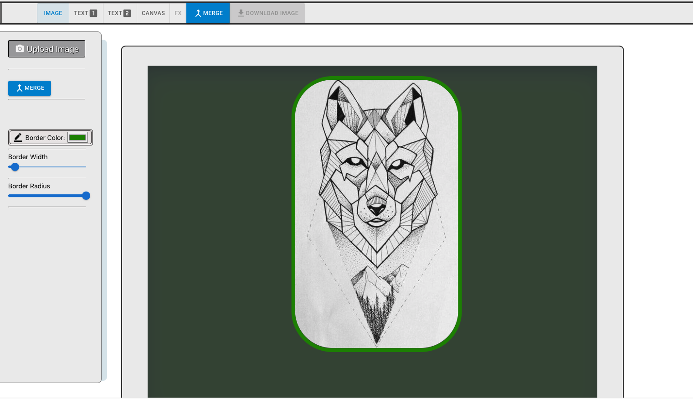

# MERGER -

An image work station , add text  colors,and  border to images 

-  <a href="https://meme-gen3.herokuapp.com/"><strong> The Site On Heroku </strong></a>

- Upload images
- Add Text and Colors
- merge the layers and convert to JPG,PNG,GIF,SVG
- Download the result image
- Gallery page of your images (only the users that created the images can view them)

- Images created are stored on Cloudinary, data on images snd users are stored in mobgoDB.

## Libraries used:
Back-end:
- Node
- Express
- Mongoose
- Cloudinary
- Axios
- Bcrypt

Front-end:
- React
- MUI
- styled-components
- Framer Motion
- Html2Canvas
- re-resizable
- Cloudinary-React
- react-router-dom

