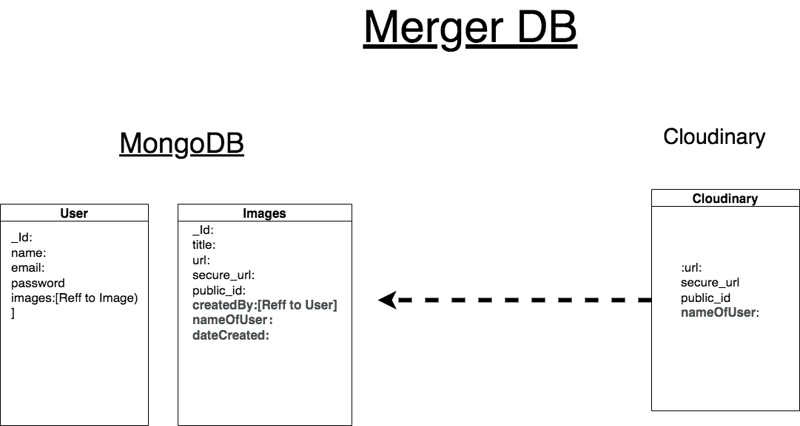

# MERGER -
## Image Editing App
### React, Node, MongoDb, Express, Cloudinary

-  <a href="https://meme-gen3.herokuapp.com/"><strong> The App On Heroku </strong></a>

- Uplaod images
- Add Text and Colors
- merge the layers and convert to JPG,PNG,GIF or SVG
- Download the result image

-Images created are stored on Cloudinary, data on images snd users are stored in mobgoDB.

